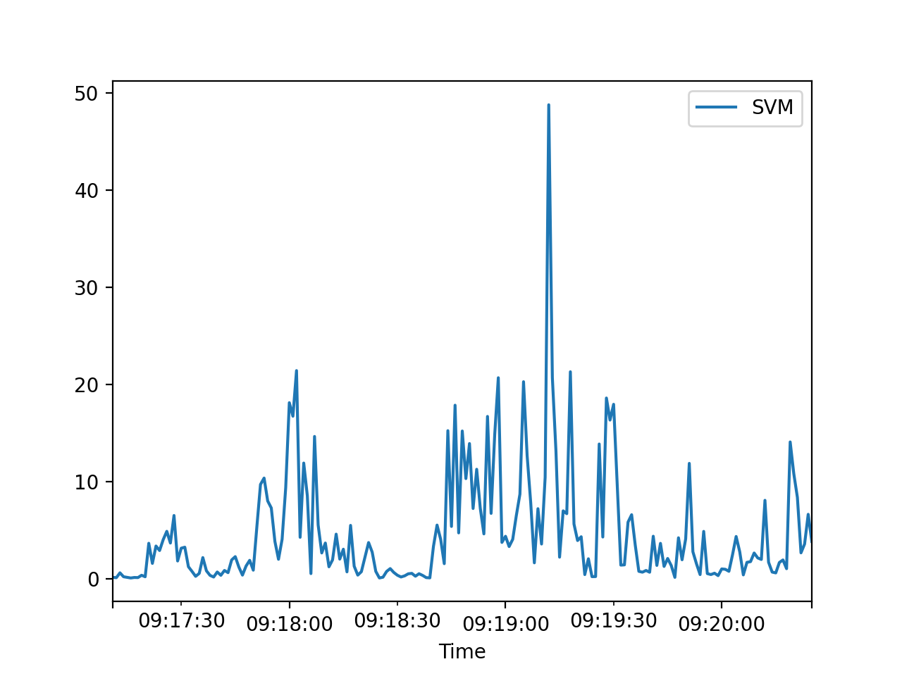

# Python-GENEActiv-Reader

Simple package for loading .bin files from GENEActiv accelerometers

<br>

## Get Started

**Installation:**
```bash
pip install git+https://github.com/RomeoSajina/Python-GENEActiv-Reader.git
```

<br>

**Usage:**
```python
from geneactiv_reader import GENEActiv

# Load from .bin file
ga = GENEActiv("example/left_ankle_example.bin")

# print raw data from .bin file
print("Raw data: ", ga.raw)

# print only calculated SVMgs (Signal Magnitude Vector)
print("Processed data: ", ga.data)

# You can aggregate across time where SVM values are summed
df = ga.aggregate("1s")

# You get pandas frame which you can plot
df.plot()
```

<br>


## Example of .bin file
For full file check out [left_ankle_example.bin](./example/left_ankle_example.bin)

<br>

And after loading .bin file, calculated SVM can be plotted


<br>


## More information

- [ActivInsights Manual](https://www.activinsights.com/wp-content/uploads/2014/03/geneactiv_instruction_manual_v1.2.pdf)
- [GENEA accelerometer](https://core.ac.uk/download/pdf/288378797.pdf)
